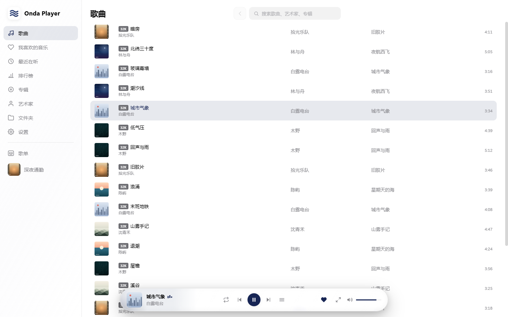
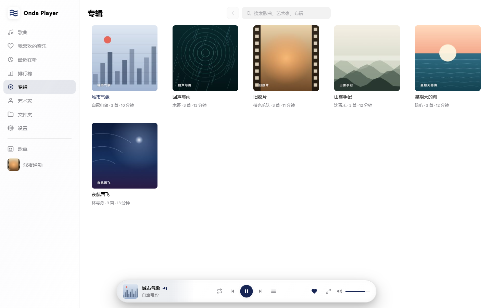
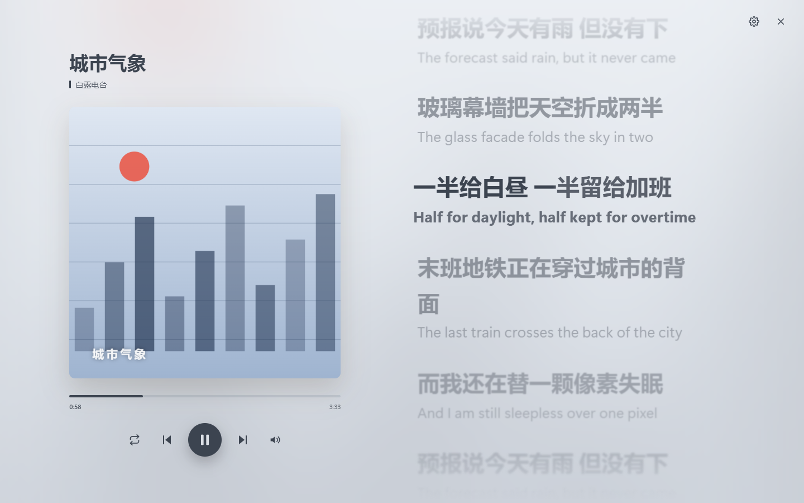
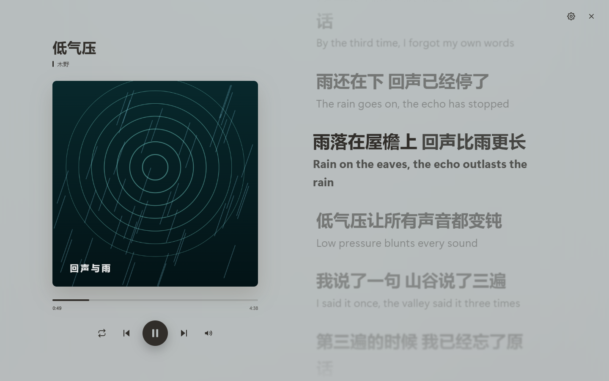
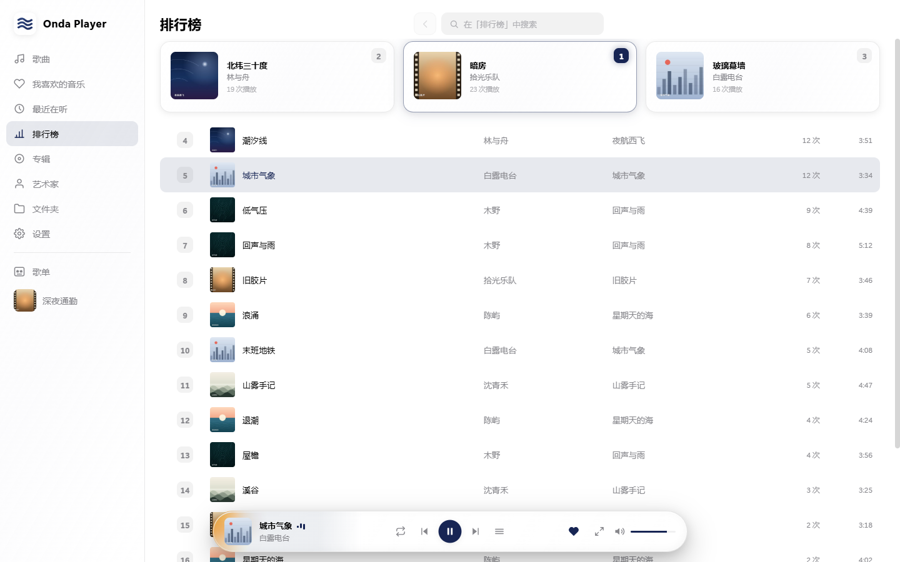
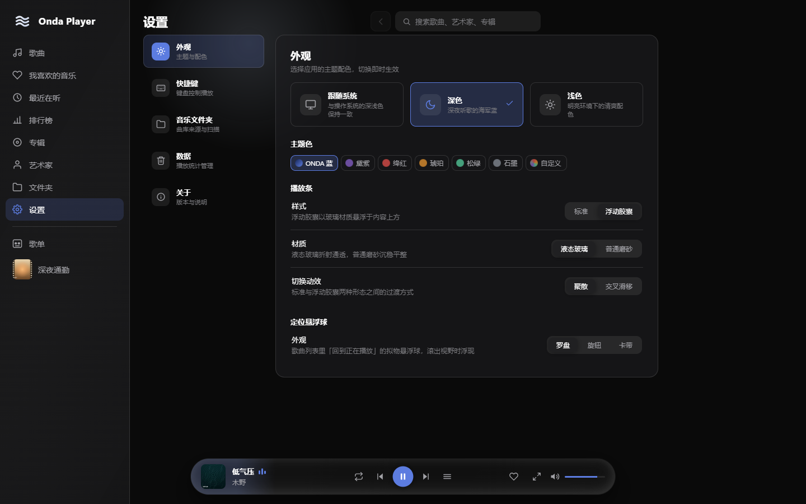
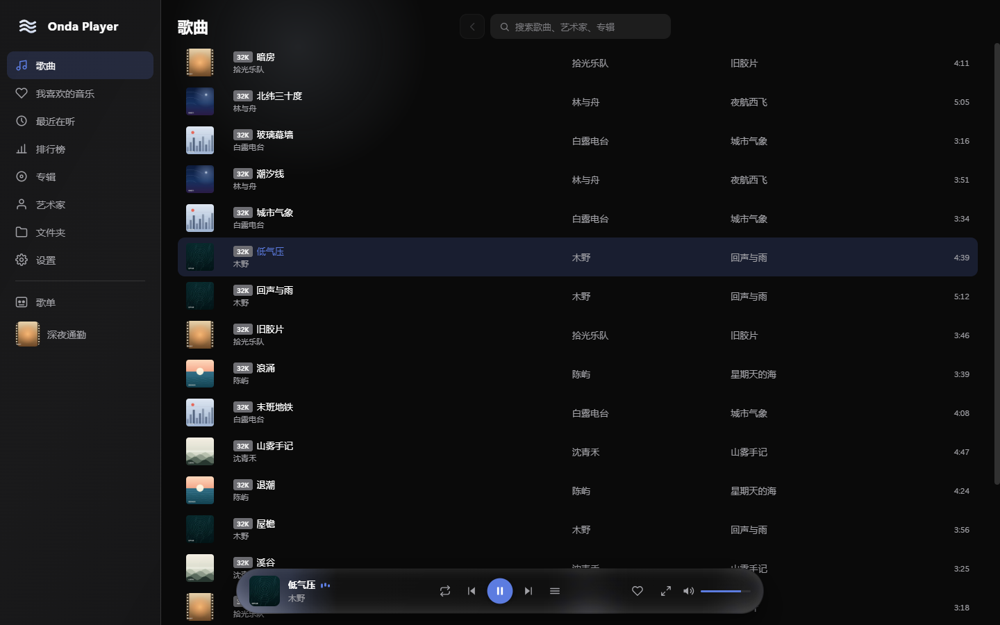
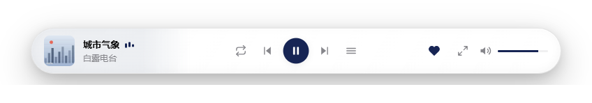

<p align="center">
  
</p>

<h1 align="center">Onda Player</h1>

<p align="center">
  <b>Windows 桌面端 / 浏览器双形态的本地音乐播放器</b><br/>
  对标 Salt Player 的桌面听歌体验 · 零网络请求 · 所有数据只留在这台机器上
</p>

<p align="center">
  
  
  
  
  
</p>

---

## 目录

- [这是什么](#这是什么)
- [界面预览](#界面预览)
- [功能特性](#功能特性)
- [两种形态](#两种形态)
- [快速开始](#快速开始)
- [技术栈](#技术栈)
- [架构与实现要点](#架构与实现要点)
- [目录结构](#目录结构)
- [开发工作流](#开发工作流)
- [隐私](#隐私)
- [已知限制](#已知限制)
- [相关文档](#相关文档)
- [致谢与声明](#致谢与声明)
- [许可](#许可)

## 这是什么

Onda Player 是一个**完全本地**的音乐播放器：你把音乐文件夹交给它，它递归扫描、解析标签与封面、建立歌曲库，然后你在里面浏览、管理、播放。**音乐文件不会被复制、移动或上传**，所有元数据、歌单、播放统计都只写进本机的 IndexedDB。

它有两个运行形态，共用同一份源码：

- **桌面端（Windows）** —— Tauri 2 应用。无边框自绘标题栏、托盘常驻、原生文件夹选择器、`media://` 协议流式读盘。这是目前的主推形态（1.0.0）。
- **网页端** —— 走 Chrome / Edge 的 File System Access API，可安装为 PWA，离线可用。

项目从 2026 年 8 月起步，按 `docs/04-开发步骤.md` 分阶段推进，每个会话的开发记录留在 `devlog/`。品牌名从早期代号演进到 **Onda Player**（曾用名 Aria·咏叹 → ONDA·澜）。

## 界面预览

<table>
  <tr>
    <td width="50%"><p align="center"><sub>歌曲列表 · 当前播放行整行高亮 · 虚拟滚动</sub></p></td>
    <td width="50%"><p align="center"><sub>专辑网格 · 封面取自内嵌图</sub></p></td>
  </tr>
  <tr>
    <td width="50%"><p align="center"><sub>全屏歌词 · 增强型 LRC 逐字点亮 · 双语合并</sub></p></td>
    <td width="50%"><p align="center"><sub>歌词页色场由当前封面取色派生</sub></p></td>
  </tr>
  <tr>
    <td width="50%"><p align="center"><sub>排行榜 · 播放次数前三名领奖台</sub></p></td>
    <td width="50%"><p align="center"><sub>设置 · 主题 / 主题色 / 播放条样式</sub></p></td>
  </tr>
  <tr>
    <td width="50%"><p align="center"><sub>深色主题</sub></p></td>
    <td width="50%"><p align="center"><sub>浮动胶囊播放条 · 封面氛围光与播放头光尘</sub></p></td>
  </tr>
</table>

> 截图里的专辑与歌曲是脚本生成的演示数据（见 `devlog/.shots-2026-09-19/readme-shots.mjs`），封面由 Canvas 程序化绘制并内嵌进音频文件，不涉及任何第三方版权素材。

## 功能特性

### 音乐库

- **多文件夹接入**：可添加多个音乐根目录；桌面端走系统文件夹选择器，网页端走 File System Access API。文件保持在原处，不做任何拷贝。
- **递归扫描 + 标签解析**：标题 / 艺术家 / 专辑 / 专辑艺术家 / 曲风 / 年份 / 音轨号 / 碟片号 / 时长 / 码率 / 采样率 / 位深，缺字段时回落到文件名与「未知专辑」。
- **增量扫描**：按「路径 + 文件大小 + 修改时间」判断变化，未变化的文件不重复解析；扫描显示进度、可随时取消，分批让出主线程，界面全程可交互。
- **封面链路**：读取内嵌封面，按「专辑 + 专辑艺术家」去重后生成 256px 缩略图存进 IndexedDB；大图场景（歌词页、专辑详情）另外按需从音频文件抽取高清图，走独立 LRU。
- **支持格式**：MP3 / FLAC / OGG / OPUS / WAV / M4A。APE、TTA 等浏览器与 WebView2 都不支持的格式会明确跳过并计入「已跳过」。
- **虚拟滚动**：万首级歌库列表滚动不卡顿。

### 浏览

侧边栏 9 个板块，顺序可拖拽自定义：

| 板块 | 说明 |
|---|---|
| 歌曲 | 全库列表，封面缩略图 + 音质徽标（Hi-Res / 无损 / 有损）+ 标题 / 艺术家 / 专辑 / 时长 |
| 我喜欢的音乐 | 播放条一键爱心收藏 |
| 最近在听 | 按最近播放时间倒序 |
| 排行榜 | 按播放次数排名，前三名领奖台展示。听满 30 秒或进度 50%（先到者）计 1 次 |
| 专辑 | 网格视图 + 专辑详情页（大封面、流派 / 音质 / 格式 / 总大小 / 碟片 / 平均码率信息面板、按碟片号分组的曲目列表） |
| 艺术家 | 网格视图 + 艺术家详情 |
| 文件夹 | 根目录卡片、权限状态、重扫（可只扫选中目录） |
| 歌单 | 见下 |
| 设置 | 见下 |

顶栏搜索支持**按当前上下文收窄**：在歌单 / 专辑 / 艺术家 / 我喜欢 / 最近在听 / 排行榜 / 文件夹里搜索，默认只搜该范围，可一键切到全库。

### 播放

- 播放 / 暂停 / 上一曲 / 下一曲 / 进度拖拽 / 音量，四种播放模式（顺序 / 列表循环 / 单曲循环 / 随机）。
- 播放队列面板：可见、可跳转、可拖拽排序、可单曲删除与清空，自动定位当前行。
- **MediaSession**：Windows 媒体浮窗与键盘媒体键可控。
- **状态持久化**：刷新或重启后恢复队列、当前曲目、进度、音量、播放模式。
- **可录制的全局快捷键**：默认 `Space` 播放/暂停、`Ctrl+←/→` 上下曲、`Ctrl+↑/↓` 音量、`Ctrl+M` 静音，可在设置里重新录制，冲突会提示。

### 歌词

- **增强型 LRC 逐字点亮**：支持 `<mm:ss.xx>` 词标签，按码点拆字符、`rAF` 直写 DOM 逐字填充；没有逐字数据时按字符类型加权做虚拟插值兜底。
- **双语合并**：时间戳相差小于 50ms 的相邻行合并为一组（原文 + 翻译 / 罗马音）。
- 点击任意歌词行跳转播放进度；歌词随播放自动居中滚动。
- 页脚设置可调字号、字重、对齐方式与逐行景深模糊。
- **封面色场**：整页底色由当前封面预烘焙取色派生（`buildCoverField` 先做 cover-fit 缩放 + 模糊 + 自适应提亮，再取主色），文字颜色按 WCAG 对比度循环压暗，当前行 ≥ 7:1、其余 ≥ 4.5:1；切歌 260ms 淡入换场。
- 无歌词时显示占位文案。

### 歌单与收藏

- 新建 / 重命名 / 删除，右键菜单（播放 / 重命名 / 设置封面 / 删除）。
- **自定义排序**：自定义顺序 / 歌名 / 艺术家 / 专辑 / 播放次数 / 时长，六种排序键随时切换。
- **手动封面**：拼贴（≥4 张封面自动 2×2 拼贴）/ 导入图片 / 恢复默认。
- 大号多选批量添加歌曲弹层：全选 / 反选 / 仅看未添加 / 已选计数。
- 全局歌曲右键菜单：播放 / 下一首播放 / 收藏 / 添加到歌单（含新建并加入）/ 查看专辑 / 查看艺术家 / 从歌单或队列或资料库移除。

### 外观与个性化

- **主题**：浅色 / 深色 / 跟随系统，切换即时生效。
- **主题色**：5 个同深度预设（黛紫 / 绛红 / 琥珀 / 松绿 / 石墨）+ 默认海军蓝 + 自定义取色器。
- **播放条**：浮动胶囊 / 标准两种形态，液态玻璃 / 普通磨砂两种材质，聚散 / 交叉滑移两种切换动效；封面氛围光与播放头光尘随封面取色。
- **定位悬浮球**：罗盘 / 旋钮 / 卡带三种外观，「回到正在播放」的拟物悬浮球。
- 列表条目的滚动错峰浮现、字母吸顶、专辑跳转的「引力坍缩」过渡。

### 桌面端专属

- **无边框自绘标题栏**：拖拽区 + 最小化 / 最大化（图标随状态切换）/ 关闭，关闭键悬停转红。
- **托盘常驻**：图标 + **自绘浮层菜单**（独立 webview，显示当前曲目封面与标题、播放控制四个按钮、跳设置、退出）。关窗即隐藏到托盘，退出只走托盘菜单；播放控制点完不收菜单，状态就地刷新。
- **单实例锁**：重复启动唤起已有窗口。
- **窗口状态记忆**：位置与尺寸重启恢复，最大化只记状态；恢复前校验是否落在屏幕外。
- **原生文件接入**：Rust 侧递归枚举目录，`media://` 自定义协议按 HTTP Range 流式返回音频，`audio.src` 直接指向协议 URL（整文件不进内存）。
- 无授权确认流程：桌面端在 IndexedDB 里存目录**路径**而非 FSA 句柄，启动即用。

## 两种形态

一份源码，两个壳。`tauri.conf.json` 的 `frontendDist` 直接指向 `../dist`，`devUrl` 指向 `http://localhost:5180` —— 改 `src/` 里任何文件，两端同时都改了。

平台差异**全部收敛在服务层**（`services/fs.ts` / `scanner.ts` / `player.ts`），界面与 store 不感知运行形态：

| 能力 | 桌面端（Tauri / WebView2） | 网页端（Chrome / Edge） |
|---|---|---|
| 选文件夹 | `tauri-plugin-dialog` 原生对话框 | `showDirectoryPicker` |
| 枚举文件 | Rust 侧递归 + 返回 size/mtime | JS 递归 FileSystemDirectoryHandle |
| 播放 | `media://` 协议 Range 流式 | `URL.createObjectURL(file)` |
| 标签解析 | 读头部字节 → `parseBuffer` | `parseBlob(file)` |
| 授权恢复 | 存路径，无需确认 | 存句柄，重开需确认一次 |
| 离线外壳 | 应用本身即本地 | Service Worker 缓存外壳 |
| 窗口集成 | 自绘标题栏 / 托盘 / 单实例 | 无 |

> 为什么桌面端不走 File System Access API：WebView2 **有意禁用**了整套 FSA（`showDirectoryPicker` 为 `undefined`，微软文档明示不支持）。这一点在第 9 阶段立项时实测确认，因此文件接入层整体原生化。

## 快速开始

### 环境要求

- **桌面端**：Windows 10/11 + [Node.js](https://nodejs.org/) ≥ 20.19 + [Rust 工具链](https://rustup.rs/)（MSVC target）+ Visual Studio Build Tools（C++ 桌面开发）
- **网页端**：Node.js ≥ 20.19 + Chrome / Edge 最新版（依赖 File System Access API）
- 页面必须通过 `http(s)` 访问，`file://` 直接打开无效

```bash
npm install
```

### 桌面端

**开发模式**（改前端热更新，不产出安装包）：

```bash
npm run dev            # 终端 1：Vite dev server → http://localhost:5180
npm run desktop        # 终端 2：tauri dev，开桌面窗口并连 5180
```

Windows 上也可直接双击根目录 **`开发桌面端.bat`** —— 它会自动检测并启动 5180、检查单实例锁冲突，再拉起 `tauri dev`。

> ⚠️ **开发前务必退出已安装的 Onda Player**：开发实例与已安装版共用同一 identifier，已安装版开着时开发窗口会**静默秒退**（exit 0，现象极易误判）。

**打包安装包**：

```bash
npm run desktop:build  # tauri build → src-tauri/target/release/bundle/nsis/Onda Player_<版本>_x64-setup.exe
```

release 全量编译较慢（首次约 5 分钟），产物是单文件 NSIS 安装包，双击安装即可。

### 网页端

```bash
npm run dev            # 开发服务器 → http://localhost:5180（strictPort）
npm run build          # vue-tsc 类型检查 + 生产构建到 dist/
npm run preview        # 预览构建产物
```

生产构建产物也可以用仓库自带的极简静态服务器托管（只读 `dist/`，无任何外部请求）：

```bash
node server.mjs        # http://localhost:5181
```

浏览器里访问后，在「设置 → 音乐文件夹」授权本地音乐目录即可开始扫描；Chrome / Edge 还会提供「安装到桌面」，装成 PWA 后独立窗口运行、离线可用。

## 技术栈

| 领域 | 选型 |
|---|---|
| 框架 | Vue 3（`<script setup>` 组合式 API）+ TypeScript |
| 构建 | Vite 7 |
| 状态管理 | Pinia 3 |
| 本地存储 | idb 8（IndexedDB Promise 封装） |
| 音频元数据 | music-metadata 11 |
| 播放 | HTMLAudioElement（单例）+ MediaSession API |
| 桌面壳 | Tauri 2（Rust）+ WebView2 |
| 托盘 / 原生对话框 | tray-icon、`tauri-plugin-dialog` |
| PWA | 手写 Service Worker（`public/sw.js`）+ Web App Manifest |

除上表外**没有引入其他运行时依赖**，也没有 UI 组件库 —— 组件、图标、动效全部手写。

## 架构与实现要点

### 应用结构

```
入口 main.ts
  ├─ 判断窗口角色：index.html?tray=1 → 托盘浮层（src/tray.ts）
  └─ 否则 → 启动过场 BootSplash → 动态 import ./boot → 挂载主应用
```

主应用挂载刻意延后到过场波浪成形之后：入口 chunk 只留 Vue + 过场，首帧就能画出来；那约 100ms 的模块求值 + 挂载长任务被安排在不打断动画的位置。

### 状态

Pinia 分 7 个 store：`library`（歌曲库与扫描状态）、`player`（队列 / 播放状态 / 模式 / 音量）、`playlist`、`favorites`、`stats`（播放统计）、`settings`（主题与偏好）、`ui`（导航 / 详情层 / 弹层 / 滚动位置）。持久化统一走 `services/db.ts`，全应用唯一数据库入口。

### IndexedDB 数据模型（库名 `music-player`，v2）

| Object Store | Key | Value |
|---|---|---|
| `handles` | `root:<id>` | FSA 句柄（网页端）或目录路径（桌面端） |
| `songs` | `path` | SongRecord 全量元数据 |
| `covers` | `coverId` | 256px 缩略图 Blob |
| `playlists` | `id` | 歌单与曲目顺序 |
| `kv` | string | 设置、上次播放状态、根目录顺序、导航顺序 |
| `stats` | `path` | `{ playCount, lastPlayedAt }` |
| `favorites` | `path` | `{ addedAt }` |

### Rust 侧（`src-tauri/src/lib.rs`）

- `list_audio_files(dir)` —— 递归枚举音频文件（跳过隐藏目录），返回 `{ abs, rel, size, mtime_ms }`。
- `read_head(path, max_len)` —— 读文件头部字节，经 `tauri::ipc::Response` 二进制通道回传（JSON 数组通道对 MB 级数据太慢）。
- `read_text_file(path)` —— 读 `.lrc` 文本。
- `media://` 自定义协议 —— 解析 Range、4MB 分块流式返回、`Content-Range`、按扩展名给 MIME、`CORS *`。
- 托盘浮层：`tray_menu_state` / `tray_menu_state_sync` / `tray_menu_resize` / `tray_menu_hide` / `tray_show_main` / `tray_quit`。

**托盘菜单是个独立 webview**：Rust 建一个 `tray-menu` 窗口，加载 `index.html?tray=1`，由 `src/tray.ts` 单独挂载一个 Vue 应用。它不跑启动过场、不建 Pinia、不注册 PWA。主窗口 → 浮层用 `tray_menu_state` 推进状态（Rust 缓存最近一份，右键展开时回放，避免漏掉「打开之前」的那次更新）；浮层 → 主窗口用 `tray://*` 事件广播，播放逻辑始终只有主窗口一个出处。

### 视觉与动效基建

- 颜色 / 尺寸**只用 CSS 变量**（`styles/main.css` 深浅两套令牌），组件里不出现硬编码色值（封面取色派生的动态令牌除外）。
- 磨砂面板走 `backdrop-filter`，统一由 `--glass-bg` / `--glass-blur` 令牌提供。
- 无实时全屏 `filter: blur()` —— 歌词页色场、专辑头部光晕都预烘焙成图，动效走纯合成层。
- 全部动效尊重 `prefers-reduced-motion`。

## 目录结构

```
src/
  main.ts              入口（按窗口角色分流：主应用 / 托盘浮层）
  boot.ts              主应用挂载
  App.vue              布局壳：标题栏 + 侧边栏 + 内容区 + 播放条
  styles/main.css      CSS 变量（深浅两套）+ 全局样式
  types/               SongRecord / Album / Playlist 等类型
  views/               14 个视图（songs / albums / albumDetail / artists / artistDetail /
                       charts / favorites / recent / folders / playlists /
                       lyricsFull / searchResults / settings / placeholder）
  components/          Sidebar / PlayerBar / TitleBar / TrayMenu / SongList / VirtualList /
                       CoverImage / ProgressSlider / AppSwitch / BootSplash / 图标集 …
  composables/         useDragReorder / useMagneticGrid / usePlaylistMenu /
                       useSearchScope / useSongActions / useStaggerReveal
  services/
    fs.ts              文件夹授权、句柄持久化、递归枚举（含桌面端分支）
    scanner.ts         标签解析、封面缓存、增量扫描
    db.ts              IndexedDB 封装（唯一数据库入口）
    player.ts          audio 单例封装
    lyrics.ts          .lrc 解析、时间戳分组、逐字时间
    palette.ts         封面取色（氛围光 / 歌词色场）
    desktop.ts         窗口定位、窗口状态记忆、托盘事件中继
    trayMenu.ts        托盘浮层与主窗口的状态契约
    pwa.ts             Service Worker 注册与安装提示
  stores/              7 个 Pinia store

src-tauri/            桌面壳（Tauri 2）
  tauri.conf.json      productName / devUrl 5180 / NSIS 打包
  src/lib.rs           media:// 协议、目录枚举、托盘浮层窗口
  icons/              应用图标（由品牌 SVG 生成）
  capabilities/       权限配置（main + tray-menu 两个窗口）

public/               favicon / logo / manifest.webmanifest / sw.js
brand/                品牌资产母版与导出（SVG 源文件 + PNG）
docs/                 需求 / 技术方案 / 设计规范 / 开发步骤 + README 截图
devlog/               每日开发日志与各阶段验证脚本（含 .shots-* 截图留档）
server.mjs            托管 dist/ 的本地静态服务器（5181）
开发桌面端.bat        一键启动桌面端开发
```

## 开发工作流

| 命令 | 作用 |
|---|---|
| `npm run dev` | Vite 开发服务器 → http://localhost:5180（`strictPort`） |
| `npm run build` | `vue-tsc` 类型检查 + 生产构建到 `dist/` |
| `npm run preview` | 预览构建产物 |
| `npm run desktop` | `tauri dev`：连 5180 开桌面窗口，前端改动热更新，**不产出安装包** |
| `npm run desktop:build` | `tauri build`：release 编译 + NSIS 打包，产出安装包（慢，仅分发时用） |

几点约定：

- **改 `src/` 用 `npm run dev` 在浏览器里看最快**，且天然对两端都生效；只有验证窗口级行为（标题栏 / 托盘 / 原生文件对话框 / 单实例）才必须开桌面窗口。
- 改 `src-tauri/` 下的 Rust 代码或 `tauri.conf.json`，`tauri dev` 会自动增量重编译并重启窗口；`vite.config.ts` 里刻意把 `src-tauri/target` 排除出 watch —— cargo 替换 DLL 会让 chokidar 抛 EBUSY 崩溃。
- **已安装的桌面版永远不会自动同步**：它内嵌的是打包那一刻的 dist 快照，要更新必须重新 `npm run desktop:build` 再装。
- 开发服务器固定 5180（`strictPort`），因为桌面端的 `devUrl` 指向它。
- 提交前跑一次 `npm run build`，`vue-tsc` 会在类型层面把关。
- 每个会话结束时更新 `devlog/YYYY-MM-DD.md`，阶段进度标记更新在 `docs/04-开发步骤.md`。

## 隐私

- **零网络请求**：应用运行时不发起任何网络请求，无遥测、无 CDN、无字体外链、无封面在线补全。
- 音频文件始终从本地磁盘实时读取，不复制、不上传。
- 全部数据（歌曲元数据、封面缩略图、歌单、收藏、播放统计、设置）只存在本机浏览器的 IndexedDB / localStorage 里。
- 卸载或清除站点数据即彻底抹除，云端没有任何副本。

> README 里的徽章图片与截图是仓库文档的一部分，不参与应用运行。

## 已知限制

- **只支持 Windows**。桌面壳目前只配置了 NSIS 打包，macOS / Linux 未做适配。
- **窗口不做材质透出**（透出桌面 + Acrylic 磨砂）—— 试过一版，深色模式下页面底色会被底下那层不透明白抬亮到 `#454545`，明暗层次整个反掉，已整体回退；窗口保持不透明。
- APE / TTA 等格式无法播放，扫描时跳过并计入「已跳过」。
- 网页端每次重开页面需要确认一次文件夹授权（浏览器安全机制，无法绕过）。
- Service Worker 只缓存应用外壳（HTML / JS / CSS / 图标），不缓存音频与歌词。
- 万首级真实歌库的扫描与滚动性能尚未在真机上压测过。

## 相关文档

| 文件 | 内容 |
|---|---|
| [`docs/01-需求说明.md`](docs/01-需求说明.md) | 功能需求与验收总纲 |
| [`docs/02-技术方案.md`](docs/02-技术方案.md) | 技术栈、架构、数据模型、桌面端工作流 |
| [`docs/03-设计规范.md`](docs/03-设计规范.md) | 配色、磨砂、布局、组件状态规范 |
| [`docs/04-开发步骤.md`](docs/04-开发步骤.md) | 分阶段计划与当前进度 |
| [`devlog/`](devlog/) | 每日开发日志：每个决策的来龙去脉、量化验证数据 |
| [`AGENTS.md`](AGENTS.md) | AI 协作指引（本仓库的工作约定） |

## 致谢与声明

- 产品体验对标 **Salt Player**，界面语言参考了网易云音乐等主流播放器的成熟做法；本项目与之均无隶属关系，也未使用其任何素材。
- 品牌标识、应用图标、界面图标与截图中的演示封面均为本项目自行绘制。
- 图标为手写 SVG，动效为手写 CSS / `rAF`，未引入第三方动画库。

## 许可

本仓库**未附开源许可证**，默认保留所有权利（All rights reserved）。

若你希望以开源方式分发，请在仓库根目录添加 `LICENSE` 文件（MIT / Apache-2.0 等都是常见选择）—— 这不影响你自己使用与修改。
